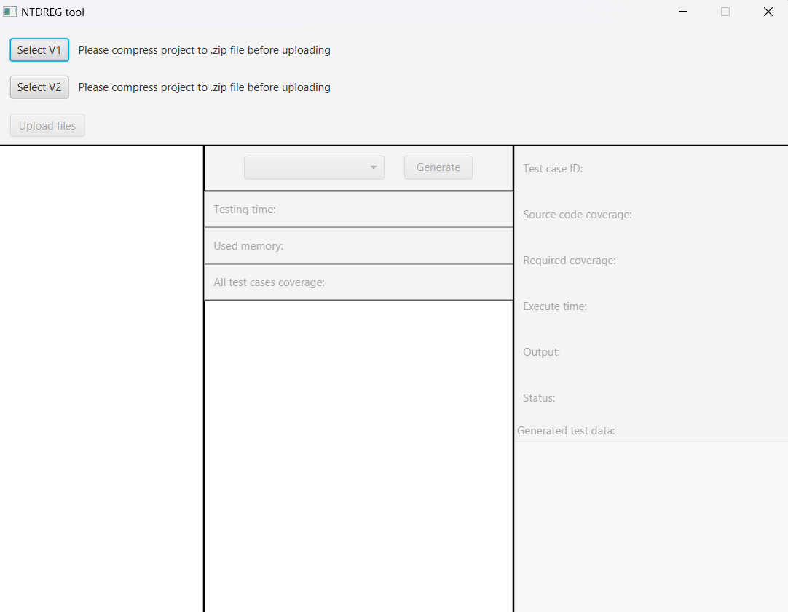
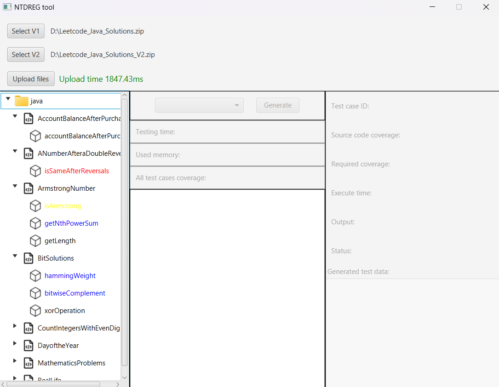
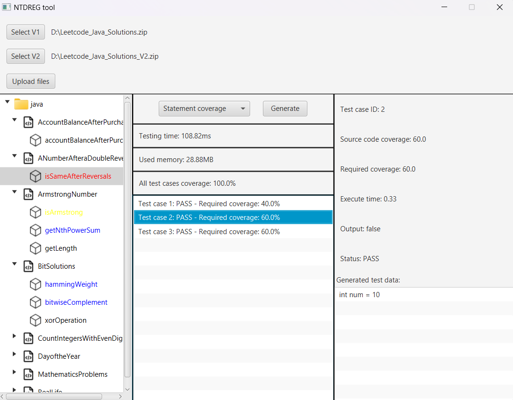

# NTDREG: An Effective Regression Testing Tool For Java Projects
## USER MANUAL
### Required environment
- Our implementation has been tested on the Windows, Intel®Core™i7-1165G7 CPU @ 2.80GHz, 16GBs RAM memory.
- IntelliJ IDEA, which is available [here](https://www.jetbrains.com/idea/download/)
- [Java 17 SDK](https://www.oracle.com/java/technologies/javase-jdk17-downloads.html)
- [Download JavaFX SDK (Version: 17.0.10, Type: SDK)](https://gluonhq.com/products/javafx/)
- [z3 solver (Version >= 4.12.2)](https://github.com/Z3Prover/z3)
    - Extract the downloaded file
    - Add the path to the `bin` folder to the system environment variable `PATH` or `Path`
## How to Run?
1. Clone and Open the project in IntelliJ IDEA
2. Add JavaFX SDK to the project (File -> Project Structure -> Libraries -> Add -> Java -> Select the lib folder of JavaFX SDK)
3. Edit Configuration
    - New Configuration -> Application
    - Main class: `gui.Main`
    - Modify options -> Add VM options: `--module-path <path-to-lib-folder-of-javafx-sdk> --add-modules javafx.controls,javafx.fxml` (TODO: Change the path to your JavaFX SDK lib folder)
4. Run the project, the main screen looks like this:

5. Upload the source code V1 and V2 of the project by clicking the `Select V1` and `Select V2` buttons
Note:
    - We have provided our 2 version of the experimental project - "Leetcode_Java_Solutions" and "Leetcode_Java_Solutions_V2" in the `sample` folder.
    - The project should be compressed into a zip file.
6. After the project is uploaded, the main screen should look like this:

Note:
    - Units with black text color is unchanged units in version 2 of the project.
    - Units with red text color is added units in version 2 of the project.
    - Units with yellow text color is impacted units in version 2 of the project.
    - Units with blue text color is changed units in version 2 of the project.
7. After the two versions of the project are uploaded, choose the unit and then choose the coverage criteria.
8. Click the `Generate` button to start the testing process. The result will be displayed, and you can click to each test case to see the details as well as below:
